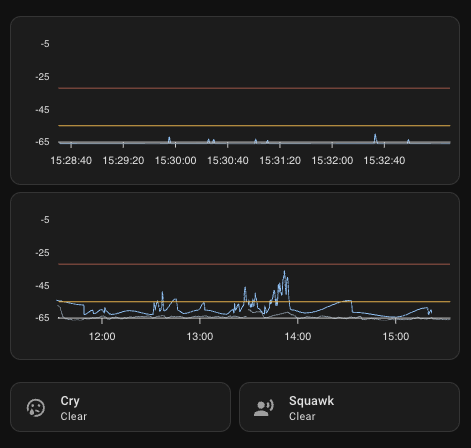
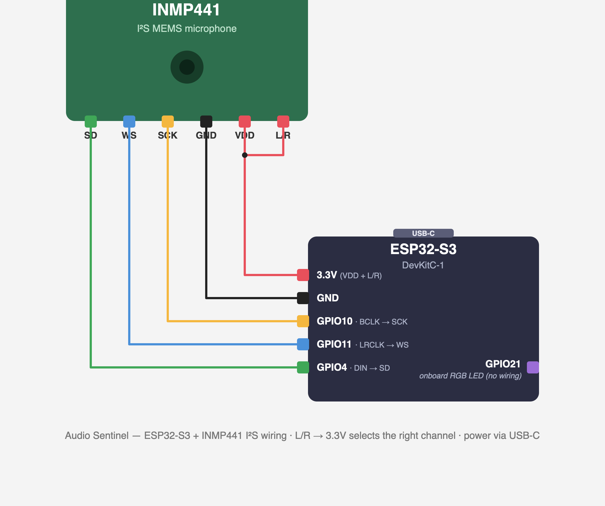

# Audio Sentinel

ESPHome firmware for an **ESP32-S3 + INMP441 I²S microphone** that turns the mic
into a low-latency **audio sentinel** — built for monitoring a sleeping baby (or
any person), surfaced in **Home Assistant** as live + historical sound charts and
two configurable alarms (*squawk* and *cry*).

It does **not** record or stream audio. It only computes sound-level (dB) features
on-device and publishes numbers, so it is privacy-preserving by design.



*Home Assistant view — top: live 5-min short window; bottom: 4-hour long window.
**Blue** = peak dB, **grey** = adaptive noise floor, **orange** = squawk threshold,
**red** = cry threshold. The **Cry** / **Squawk** cards below are the binary-sensor
alarms (shown `Clear`).*

---

## What it does

The INMP441 feeds the official ESPHome `sound_level` sensor (RMS + peak dB). A
custom **`audio_sentinel` external component** then runs the signal processing:

- **Adaptive noise floor** — a gated EMA that learns the room's ambient level and
  drifts slowly, so the baseline tracks a quiet nursery without chasing events.
- **Smoothed envelope** (instant attack / moderate release) so a cry shows up
  immediately but doesn't flicker.
- **Two visualization series**:
  - **Live (short window)** — 5-minute peak + noise-floor trace, gated so quiet
    periods read as a flat line and events stand out.
  - **Events (long window)** — a peak-hold envelope (20 s hold, glide-to-baseline)
    recorded with HA long-term statistics for a 4-hour overview.
- **Squawk / Cry binary sensors** — hysteresis comparators on peak dB against two
  user-adjustable thresholds. Wire these to HA automations/notifications so a
  caregiver is alerted when the baby is stirring vs. genuinely crying.
- **Ring buffer + HTTP endpoint** (`GET /api/audio_buffer`) so the HA chart can
  back-fill the last 5 minutes the instant the dashboard loads.

The Home Assistant view (ApexCharts) shows a **short window** (live, 5 min) and a
**long window** (events, 4 h), with the squawk/cry thresholds drawn as guide lines.

---

## Hardware

| Signal        | ESP32-S3 pin | INMP441 pin |
|---------------|--------------|-------------|
| I²S BCLK      | GPIO10       | SCK         |
| I²S LRCLK/WS  | GPIO11       | WS          |
| I²S DIN       | GPIO04       | SD          |
| Status LED    | GPIO21       | — (onboard WS2812) |
| 3V3 / GND     | 3V3 / GND    | VDD / GND, **L/R → 3V3** |

- Board: `esp32-s3-devkitc-1` (Arduino framework).
- INMP441 `L/R` tied high → right channel (matches `channel: right` in `mic.yaml`).
- Onboard WS2812 status LED: off at boot, **blue** once Wi-Fi connects.



---

## Repository layout

```
audio-sentinel.yaml          # DEVICE/CONSUMER config: pulls packages + component from github:// (pinned @tag)
audio-sentinel.dev.yaml      # LOCAL-DEV variant: builds packages + component from this working tree
audio-sentinel/              # reusable library, namespaced so it never clashes in a shared dir
  packages/                  #   (consumed remotely by devices, or locally by the .dev entry)
    network.yaml             # wifi, api, ota, captive_portal, web_server  (uses ${substitutions}, no !secret)
    mic.yaml                 # i2s_audio, microphone, sound_level (spl_db / spl_peak_db)
    sentinel.yaml            # audio_sentinel hub + its sensors/binary_sensors + thresholds + audio switch
    diagnostics.yaml         # heap (debug), uptime, status LED
  components/
    audio_sentinel/          # the external component (Python codegen + C++ DSP)
      __init__.py  sensor.py  binary_sensor.py  audio_sentinel.h  audio_sentinel.cpp
ha/
  dashboard.yaml             # ApexCharts card (short + long window)
  rest_command.yaml          # HA rest_command that calls /api/audio_buffer
secrets.yaml.example         # template — copy to secrets.yaml (git-ignored)
```

The firmware uses the ESPHome [packages](https://esphome.io/components/packages/)
pattern + an [external component](https://developers.esphome.io/blog/2025/02/19/about-the-removal-of-support-for-custom-components/)
(the sanctioned replacement for the now-removed `includes:`/custom-component style).
Both are pulled **remotely** from this public repo over `github://`, pinned to a
release tag — so a device is just a small local config that fills in secrets +
wiring. Because remote git packages can't use `!secret`, `network.yaml` takes its
credentials as `${substitutions}` that the device config supplies from `!secret`.

---

## Installation — which file goes where

There are **two independent halves**: the **firmware** (built/flashed by ESPHome)
and the **Home Assistant config** (the chart card + REST command). The `ha/` folder
in this repo is **reference only** — ESPHome never reads it; you copy its contents
into Home Assistant by hand.

### A. Firmware (ESPHome)

A device is a **single local config** that pulls the packages + component from this
repo over `github://` (pinned to a tag) and fills in its own secrets. Nothing under
`audio-sentinel/` needs copying — ESPHome fetches and caches it at build time.

```
/config/esphome/                 # shared ESPHome dir — other devices live here too
├── audio-sentinel.yaml          # ← the one file you add (pulls everything remotely)
├── secrets.yaml                 # ← you create this; shared by all your devices
└── kitchen-sensor.yaml          # (your other devices — untouched)
```

1. Add **`audio-sentinel.yaml`** to the dir (copy it from this repo / the
   [v1.1.1 release](https://github.com/dude84/esphome-audio-sentinel/releases)).
   It already points at `github://dude84/esphome-audio-sentinel@v1.1.1`.
2. Create `secrets.yaml` next to it — `wifi_ssid`, `wifi_password`, `ap_password`,
   `api_password`, `ota_password` (see `secrets.yaml.example`). The add-on uses
   `/config/esphome/secrets.yaml` for every device.
3. Edit the `substitutions:` at the top of `audio-sentinel.yaml` — `static_ip`,
   GPIO pins, `name`. Secrets are injected from there as `!secret …` substitutions.
4. Build + flash (the **first** build fetches the packages + component from GitHub):
   - **Add-on:** ESPHome dashboard → the device → **Install** (USB first, then OTA).
   - **CLI:** `esphome run audio-sentinel.yaml`
5. After boot it auto-discovers in HA (**Settings → Devices & Services → ESPHome**).
   Sanity-check the buffer endpoint:
   ```bash
   curl "http://<device-ip>/api/audio_buffer?count=1200"
   # -> {"count":1200,"ms":250,"p":[...],"n":[...]}
   ```

**Pinning & multiple devices.** Each device is pinned to a tag (`@v1.1.1`), so a push
to `main` never changes a device until you bump its ref. For several devices, copy
`audio-sentinel.yaml` per device (`nursery.yaml`, `bedroom.yaml`, …) and just change
the `substitutions:` — they all share this one remote library.

**Developing the packages/component.** To change the DSP or packages themselves,
clone the repo and build **`audio-sentinel.dev.yaml`** (includes everything from the
working tree — no fetch), then commit, tag a new release, and bump the device refs.

### B. Home Assistant (chart + REST command)

1. **HACS cards:** install [ApexCharts card](https://github.com/RomRider/apexcharts-card)
   and [card-mod](https://github.com/thomasloven/lovelace-card-mod) (for the
   spinner-hiding style), then reload the browser.
2. **REST command:** copy the `rest_command:` block from `ha/rest_command.yaml` into
   your **`/config/configuration.yaml`** (set the host to your device IP). If you
   already have a `rest_command:` key, merge the entry under it. **Restart HA.**
   This is what the chart calls to back-fill history (see *On-device buffer API*).
3. **Chart card:** in a dashboard choose **Edit → Add card → Manual**, paste the
   contents of `ha/dashboard.yaml`, and save. (Or add it under `cards:` in a
   YAML-mode dashboard.)

> Entity slugs in `ha/dashboard.yaml` assume the default `name: audio-sentinel`.
> If you changed `name:`, update the `entity:` lines (and the URL in
> `ha/rest_command.yaml`) to match.

Entities published (slugs assume the default `name: audio-sentinel`):

| Entity | Purpose |
|--------|---------|
| `sensor.audio_sentinel_peak_db_live` | live peak (short window) |
| `sensor.audio_sentinel_noise_floor` | adaptive noise floor |
| `sensor.audio_sentinel_peak_db_events` | peak-hold events (long window, statistics) |
| `sensor.audio_sentinel_squawk_threshold` / `_cry_threshold` | threshold guide lines |
| `binary_sensor.audio_sentinel_squawk` / `_cry` | alarm triggers (device_class: sound) |
| `number.audio_sentinel_squawk_threshold_db` / `_cry_threshold_db` | adjust thresholds |
| `switch.audio_sentinel_audio` | pause/resume processing |

---

## On-device buffer API — instant chart back-fill

The device runs a small HTTP server (the ESPHome web server) that exposes the
**whole recent history in one request**, so the Home Assistant chart paints a full
window the instant it loads instead of starting blank and filling in live, one
sample every 250 ms (which would otherwise take ~5 minutes to look complete).

The `audio_sentinel` component keeps a **ring buffer of the last 1200 samples**
(peak dB + noise floor, one pair every 250 ms = 5 minutes) and serves it as JSON:

```
GET http://<device-ip>/api/audio_buffer?count=N
```

- `count` — how many of the most recent samples to return (default 480 ≈ 2 min,
  clamped to 1200 ≈ 5 min). Older slots are zero-padded if fewer exist.
- `Access-Control-Allow-Origin: *` is set so the dashboard's JS can fetch it.

When the ApexCharts card loads, its `data_generator` calls this endpoint once (via
`rest_command.baby_sentinel_audio_buffer_fetch`) and seeds both the **Peak** and
**Noise Floor** series with the returned history; from then on it appends live
values. That's the only reason the short-window chart is full immediately.

### Sample payload

Real capture from the device, quiet room (`count=8` for brevity):

```bash
curl "http://<device-ip>/api/audio_buffer?count=8"
```
```json
{"count":8,"ms":250,"p":[-65.0,-65.0,-65.0,-65.0,-65.0,-65.0,-65.0,-65.0],"n":[-64.8,-64.8,-64.8,-64.8,-64.8,-64.8,-64.8,-64.8]}
```

| Field   | Meaning |
|---------|---------|
| `count` | number of samples in this response |
| `ms`    | spacing between samples (250 ms) — the client derives each timestamp as `now - (count - i) * ms`, so no per-sample timestamps are sent |
| `p[]`   | gated peak dB per sample (the live trace) |
| `n[]`   | adaptive noise floor per sample |

A full `count=1200` response is ~10 KB. The arrays are parallel and equal length;
`p[i]` and `n[i]` share the timestamp for index `i`.

---

## Tuning

Set thresholds live from HA (the `number.*` entities) while watching the live
chart: raise **Squawk** until normal sleep noises stay below it; set **Cry** near
the level of a real cry. DSP behavior (floor drift, hold/glide, margins) is tunable
via the `audio_sentinel:` keys in `audio-sentinel/packages/sentinel.yaml` — see
`CLAUDE.md` for the full knob list and what each does.

---

## License

[MIT](LICENSE) © 2026 Maciej Rohleder.

Not affiliated with or endorsed by ESPHome or Home Assistant. This is a sound-level
monitor, **not** a medical or safety device — do not rely on it as the sole means of
monitoring an infant or patient.
